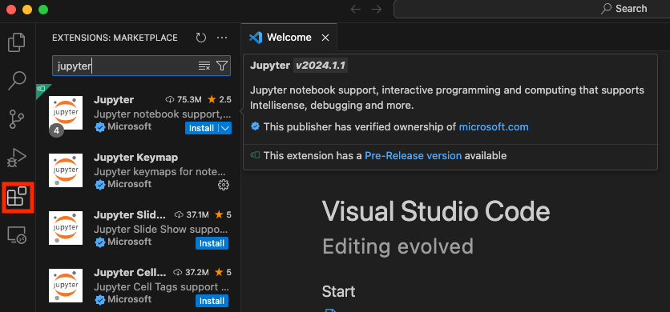
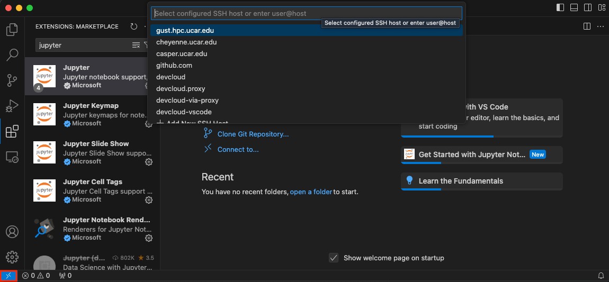
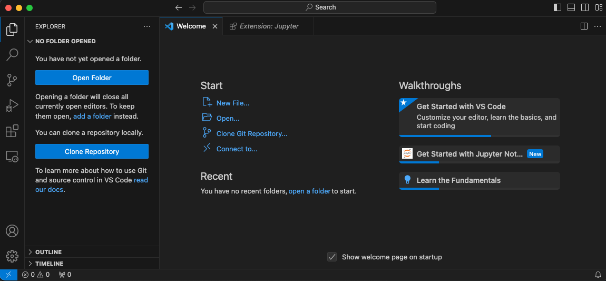
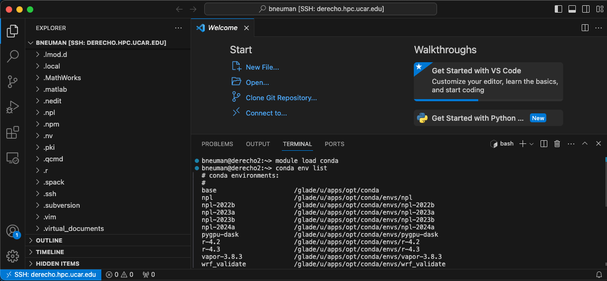
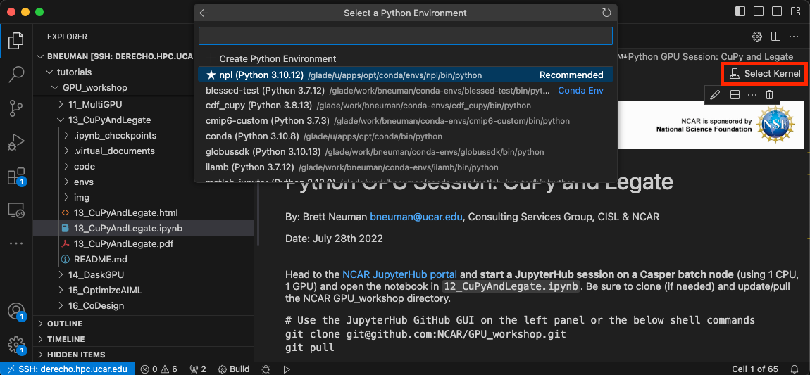
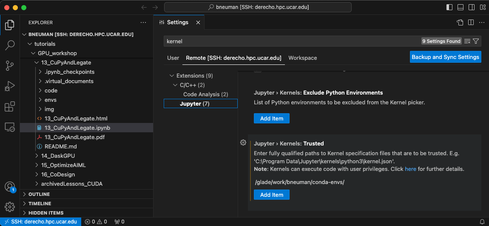
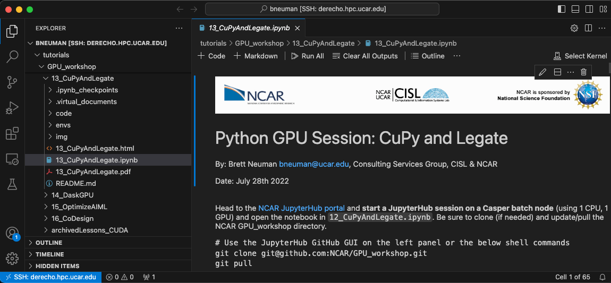

# Using VSCode for Jupyter Notebooks

VSCode is an extensible code editing software that can connect to remote systems like Derecho and Casper.  Intellisense, Jupyter, and other extensions gives you options to keep the editor as lightweight or complex as you prefer.  Additional quality of life features like GUI file transfers, a terminal window, and local or remote Jupyter notebook execution make VSCode an appealing editor for use with NCAR systems.

<!-- more -->

For NCAR, you can use VSCode as a less feature rich alternative to Jupyterhub.  It doesn't have all of the functionality of Jupyterhub but can run the same notebooks with kernels that are available on Derecho, Casper, or your own custom environments.

VSCode is available for NCAR issued laptops in the *Self Service* application.  You can find more information about VSCode and download it here: [VSCode](https://code.visualstudio.com/)

# Extensions

The Jupyter extension is required to preview and run notebooks in VSCode.  You can access the extension library by selecting the *Extensions* tab on the left side of VSCode.  Click on install and then restart VSCode after completion to run Jupyter Notebooks in VSCode.



You will also need to install the *ipykernel* extension to run cells within a Jupyter notebook.  It can be downloaded using the same method as the Jupyter extension or you will be prompted to install it the first time you run a cell in a notebook.

# Connecting to Derecho

On the bottom left corner of VSCode is a >< button that allows connection to a remote host.  A new dropdown will appear and you can select *Connect to Host* to connect to a remote host like Derecho or Casper.  Connecting to a host pulls information from your local SSH configuration file and you may already have Derecho and Casper as options to connect to.



Alternatively, when you are prompted to connect to a host you can enter the full SSH path like you would when connecting via the terminal:

```
ssh <user>@derecho.hpc.ucar.edu
```

This will connect you to a Derecho login node and you can open a terminal by selecting the menu's *Terminal* dropdown and clicking *New Terminal*.  

## Connecting to GLADE

If you prefer to use a GUI File Explorer then you can connect to the GLADE filesystem using the tabs of the left side of VSCode.  The *Explorer* tab prompts you to *Open Folder*, and if you are already connected to Derecho, then will autocomplete GLADE paths.



!!! warning 
    Only open small folders to improve performance and reduce memory load on Derecho login nodes.  VSCode will scan the entire contents of the directory at high frequency causing slow autocomplete for Intellisense and flag you for login resource abuse.


!!! tip 
    You can connect to recently used remote paths by creating a new window and selecting it from the *Recent* list.


## Terminal vs. File Explorer

Once you have connected to your GLADE path then you can work out of the VSCode File Explorer tab or the terminal.  You can create a new terminal by selecting the *Terminal* dropdown and clicking *New Terminal*. 



!!! info
    You can use the File Explorer to transfer files between your local machine and Derecho or Casper.  Right click on the file and select *Download*.


# Conda, Kernels, and Notebooks

Open a Jupyter notebook using either the File Explorer or the terminal.  For the File Explorer, you can simply click on the filename of the notebook.  Opening in terminal can use the *code* application:

```
code <path>/my_notebook.ipynb
```

  This will put you in the default kernel.  Like Jupyterhub, you will need to specify which kernel to use when executing cells in the notebook.  You need to select a kernel from within the Jupyter notebook or it will use your default kernel.



Adding your conda-envs folder to the list of *Trusted* kernels will allow you to run notebooks with these kernels without being prompted to trust the kernel each time you run select a new kernel.  Add the path by selecting *Settings* from the *Code* dropdown.  In the *Settings* window search for kernel and add your user path to the **Trusted** kernel paths.  Your custom environments should be located here:

```
/glade/work/$USER/conda-envs/
```



# Running Jupyter Notebooks

You can run cells similarly to Jupyterhub with the 'Run All' or an individual cell by hitting *Shift+Enter*.



Be mindful that you will be running your notebooks on the login nodes.  Computationally or memory intensive notebooks should be run within Jupyterhub as a batch job.  We are exploring options for running notebooks inside of PBS jobs and hope to have an solution for using VSCode on the compute nodes in the near future.
